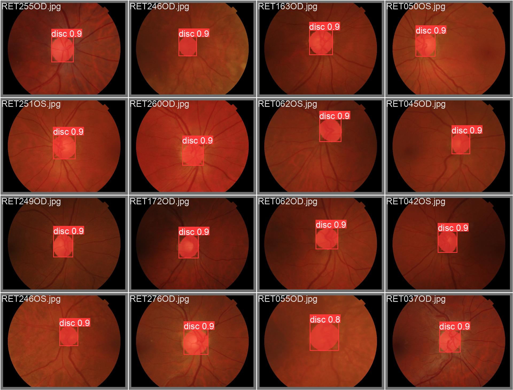

# YoloV8 Detect Optic Disc in Retina - Custom Dataset

Create a folder with the dataset separated into training, validation and testing. 
Within each one, create a folder called images where the original images will be 
located, and a folder called labels with the coordinates obtained in Prepare_labels.


------ Folder_dataset

---- Train

-- Images

  - Img1.jpg
  - Img2.jpg
  - ...
    
-- Labels

  - img1.txt
  - img2.txt
  - ...

---- Valid

-- Images

-- Label

---- Test


# Prepare dataset train
-- Create the coordinates to localize and segment optic disc.

# Create file **data.yaml** in folder train data
```ruby
train: C:/Users/debora.assis/Documents/Folder_dataset/Train/images
val: C:/Users/debora.assis/Documents/Folder_dataset/Valid/images
names: ['disc']  
```
# Train custom dataset
Run the **YOLOv8_Train_REFUGE.ipynb** code in folder **Train_data** to train the model.

# Test model
Run the **YOLOv8_Predict.ipynb** code  in folder **Test_predict** to obtain the results of segmentation and localization of the optic disc.

# Results 

| Result YOLO v8 disc optic localize and segment image|
|-----------------------------------------------------|
|  Predict localized and segmented disc optic using YOLO v8 in image|

